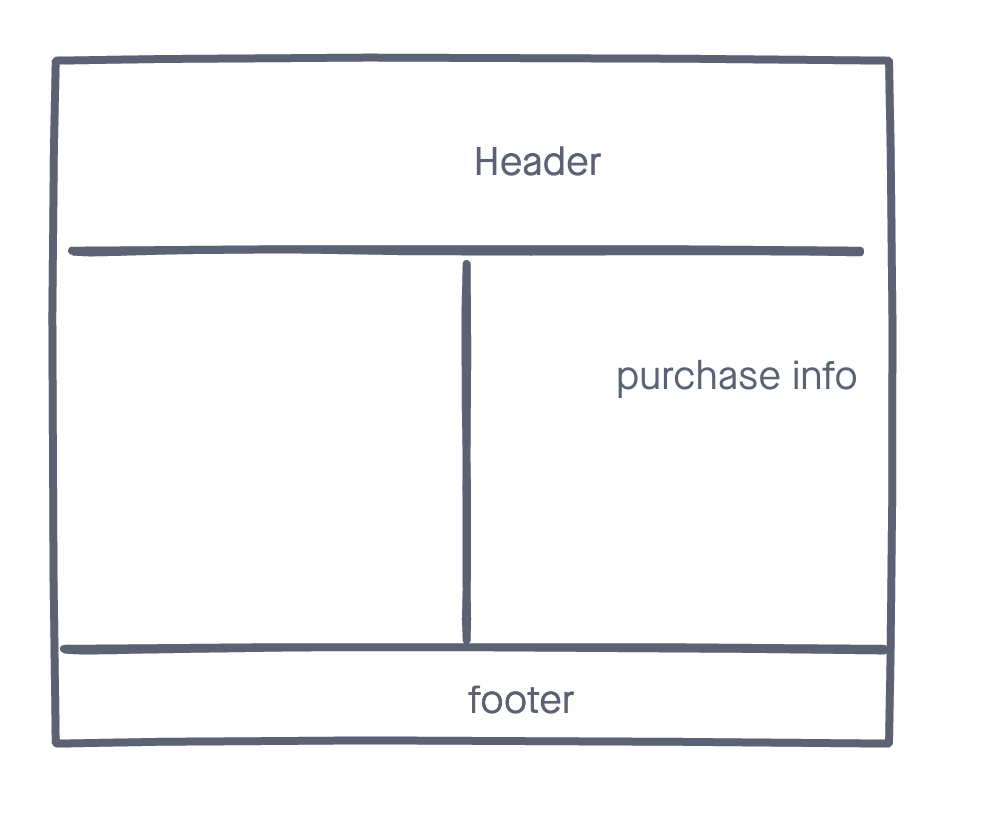
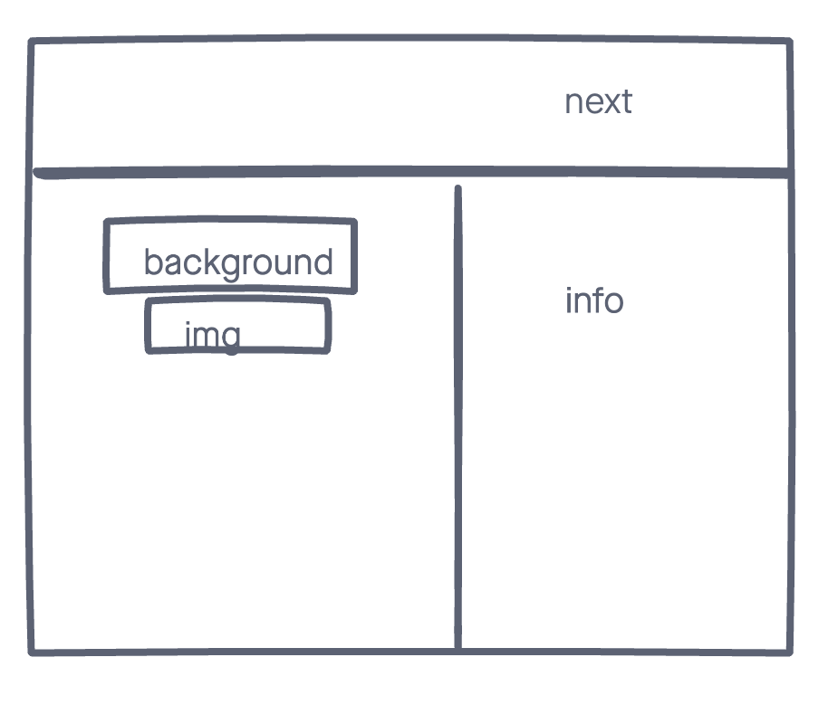

# Nootropic

A simple app that performes CRUD, Named Nootropics. Why am I building this app? I was inspired by the movie "Limitless". Nootropics are refered to as any natural or synthetic substance that may have a positive impact on mental skill. I have tried nootropics cause of my many failures in school. Inability to focus and remember information. FYI, the pill in the movie, NZT-48 does not exist.

## Techologies Used
- HTML5
- CSS3
- JS
- Mongoose
- Mongodb
- Express
- Heroku (for deployment)

## Screenshots

## Getting started

[Click](https://nootropics-app.herokuapp.com/nootropics/new/) here to get started and see the app online!

## Future Enhancements
User is able to get access to information of the product. Its origin, imgs, pricing, intake, count, etc. 